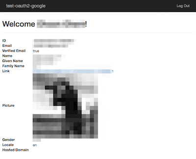
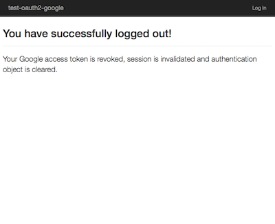

# test-oauth2-google

* Go to [Google Developers Console](https://console.developers.google.com)

    * Go to **Credentials** page.
    * Select **Add credentials** drop down list, then **OAuth 2.0 client ID**.
    * Set **Authorized redirect URIs** to `http://localhost:7777/test-oauth2-google/login` 

* Add client ID and client secret under `src/main/resources/messages.properties`.

```
google.client.id=[CLIENT-ID]
google.client.secret==[CLIENT-SECRET]
```

* Run `mvn clean jetty:run`.

* Visit `http://localhost:7777/test-oauth2-google/`

* Click **Allow** button in Google OAuth.

* At this point, you should see the protected page displaying your Google profile.

    

* Clicking on "Log Out" will properly revoke your Google access token and log you out.

    
